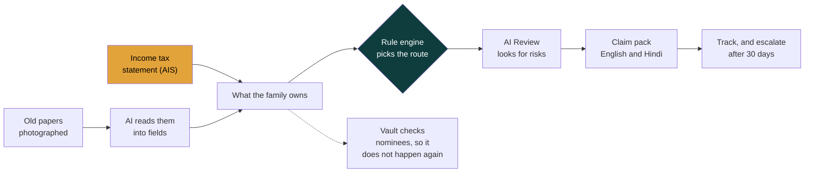

# Virasat

[](https://github.com/usv240/virasat/actions/workflows/ci.yml)

**Find forgotten family money. Know exactly how to claim it.**

Photograph a family's old papers. Virasat finds where the money is, uncovers
accounts that were never in those papers, works out how to claim each one, and
fills the forms in English and Hindi.

Built by **Team USV** for the Global Innovation Hackathon 2026: Build for a Better Future.

| | |
|---|---|
| **Try it** | https://virasat-indol.vercel.app/try (no sign up, sample family loaded) |
| **Watch it** | https://youtu.be/CMpV2y9Zoxk (3 minutes) |
| **For judges** | https://virasat-indol.vercel.app/judges (every criterion mapped to proof) |
| **Source** | https://github.com/usv240/virasat |

---

## The problem

About **₹1.84 lakh crore** of Indians' own money is lying unclaimed in banks,
insurance, provident fund and shares.[^1] It is not lost. Families simply do
not know it is there, and claiming it is different at every institution.

Three things make it stick:

1. **Nobody knew it existed.** One family member held the account and never
   told anyone. In many families bank details are never shared at all.[^2]
2. **Searching is not claiming.** Every government portal finds the asset and
   then hands the family back to the institution. The Supreme Court is hearing
   a plea about exactly this, brought on behalf of legal heirs of deceased
   depositors who cannot trace what they are owed.[^3]
3. **The paperwork defeats people.** Without a nominee, heirs may need a
   succession certificate from a civil court, which takes months. Recovery
   agents charge 5 to 15 percent to help.[^4]

The demand is proven, not assumed: Gujarat's claim camps returned **₹104 crore
across 26,874 claims**, an average of **₹38,700 per family**.[^5]

## What Virasat does



The two boxes that are coloured are the two that matter.

**The tax statement (gold)** is the idea nobody else has built. A legal heir can
obtain the account holder's Annual Information Statement, which lists every bank
and company that ever paid them interest or a dividend. One PDF reveals accounts
that never appeared in the papers the family found.

**The rule engine (dark)** is where the AI is deliberately not allowed. The claim
route is decided by versioned, tested rules, not by a model.

### The boundary, in one line

> **AI reads the documents. Deterministic, versioned rules decide the claim
> route. An independent AI review looks for risks. The family acts.**

| Step | What happens |
|---|---|
| **Find** | Read a passbook, policy bond, share certificate or PF slip. Every field carries a confidence, so nothing is silently guessed. |
| **Discover** | Parse the AIS by code, no AI call, and surface institutions the family never knew to search. |
| **Claim** | One tested rule file per institution decides nominee, legal heir or court. The rule id is printed on the answer so a bank can audit it. |
| **Review** | One AI looks for risks such as a name mismatch; another reviews the concern and can only add caution, never override the rules. |
| **Act** | A PDF claim pack: the form, the checklist, and cover letters in both languages. |
| **Track** | Status, next action, and a pre-written ombudsman complaint after 30 days. |
| **Prevent** | The Parivaar Vault checks every account has a nominee, so the next generation does not repeat the search. |

## Run it

```bash
npm install
npm run dev            # http://localhost:3000
```

No API key needed. Without one the app runs in **sample mode**: the AI steps
replay pre-computed results and the whole journey still works end to end. With
a key in `.env.local` (`ANTHROPIC_API_KEY=sk-ant-...`) your own photographs are
read live. You can also paste your own key into the app's Help tab; it stays in
your browser.

## Test it

```bash
npm test               # 57 tests: rules, AIS parser, claim pack, cost model, corpus, deck figures
npm run verify         # lint, house style, tests, type check
npm run audit          # the one that matters, see below
```

`npm run audit` re-runs **every number published on the site** and writes
[docs/AUDIT-REPORT.md](docs/AUDIT-REPORT.md), including anything that failed.
It runs lint, the writing rules, types, tests and a production build, then
points axe at all 11 pages in both themes and Lighthouse at the live
deployment three times on each profile.

Two more, both needing an API key:

```bash
npm run measure:cost   # what one family costs, using the app's own code
npm run eval           # document reading accuracy, and the AI Review
```

`npm run measure:cost` refuses to run through a proxy, because measuring
through a local cache once understated the cost by 9 percent.

## What the measurements say

Every figure here came from the commands above, not from an estimate.

| Check | Result |
|---|---|
| Automated tests | 57 of 57 pass, on every push |
| Accessibility (axe, WCAG 2.2 AA), 11 pages, light and dark | 0 serious, 0 critical, 0 moderate |
| Lighthouse, live deployment, 3 runs each | Desktop 99 to 100. Mobile, throttled, never below 90. Both 100 accessibility, best practices and SEO |
| Cost of serving one family | **₹36.44** of AI, measured against the live API with a cold cache. Against ₹38,700 returned per family, about **1,062 rupees recovered per rupee spent** |
| Document reading | 12 of 12 fields across 3 sample documents |
| The AI Review | Caught 3 of 3 planted problems. **So did a single reviewer.** We publish that; the case for the feature is transparency, not accuracy |
| Dividend list parser | 46,282 rows across 1,263 pages of real lists companies must publish. Counts only, no name kept |

## Technology

| Layer | Choice |
|---|---|
| App | Next.js 16 App Router, React 19, TypeScript strict, Tailwind CSS 4 |
| AI | Anthropic SDK, `claude-opus-5`, structured outputs with Zod schemas, prompt caching |
| Documents | pdf-parse for AIS tables, pdf-lib for claim packs |
| Decisions | A versioned rule engine, one file per institution, unit tested |
| Voice | Browser Web Speech API, in and out, Hindi and English |
| Data | Stays in the browser. Nothing personal on a server |
| API | `/api/v1`, API keys, shared rate limits, RFC 9457 errors |
| Offline | Service worker and web manifest, so it installs and survives patchy signal |

## The open rule corpus

Virasat's most reusable piece is its rule corpus: each institution's claim
procedure encoded as machine-readable, versioned rules. Today those procedures
are fragmented across institutions and public guidance. The rules capture which
documents are required, in which order, which thresholds apply, and where a
family obtains each one.

It is MIT licensed and served with no key:

```bash
curl https://virasat-indol.vercel.app/api/v1/rules/corpus
curl https://virasat-indol.vercel.app/api/v1/rules/schema
```

If a bank or a government portal serves families better by taking it, that is
the result we want. [Adding an institution](docs/CONTRIBUTING-RULES.md) is a
new rule file, with no change to application code.

## Honesty

- Sunita, Ramesh, their papers and amounts are made up.
- The unpaid-dividend index ships as sample data. Republishing real lists next
  to real names would be a ready-made target list for fraud. The parser is real
  and is tested against real published lists.
- Rule files exist for SBI, LIC, EPFO, IEPF and India Post. Anything else routes
  to "needs review" rather than a guess.
- No family has used this yet. Every impact figure is potential, not achieved.
- Virasat never logs in anywhere, never asks for a password, and never submits
  anything for you.
- This is guidance from public sources, not legal advice.

## Licence and credits

MIT. Third-party work is credited in [CREDITS.md](CREDITS.md), which is
generated from source and checked by a test. Sources for every number are at
[/references](https://virasat-indol.vercel.app/references).

Built with Claude Code, by one developer, as the hackathon rules permit and
require us to disclose.

---

[^1]: Union Finance Minister, October 2025, launching the Aapki Poonji Aapka Adhikar campaign. [Business Today](https://www.businesstoday.in/personal-finance/banking/story/finance-minister-launches-rs-1-84-lakh-crore-unclaimed-assets-campaign-496827-2025-10-04)
[^2]: [Deccan Herald](https://www.deccanherald.com/amp/story/opinion%2Fmake-the-100-day-campaign-work-1229314.html): a pensioner's son was told at the branch that his father had never nominated anyone, and that prompting a nomination was not the bank's job.
[^3]: RBI told the Supreme Court in April 2026 that UDGAM has 20 lakh users and 44 lakh searches, on a portal that searches but does not settle. The plea, by journalist Sucheta Dalal, seeks a mechanism to inform legal heirs of deceased depositors. [Drishti IAS summary](https://www.drishtiias.com/daily-updates/daily-news-analysis/rbis-udgam-portal)
[^4]: [ShareSamadhan](https://sharesamadhan.com/blog-details/46/IEPF-CONSULTANT) on consultant fees; [Kanakkupillai](https://www.kanakkupillai.com/learn/cost-to-get-succession-certificate-in-india/) on the cost and time of a succession certificate.
[^5]: [All India Radio](https://www.newsonair.gov.in/gujarat-rs-104-crore-returned-to-account-holders-under-aapki-punji-aapka-adhikar-campaign): Gujarat returned ₹104 crore on 26,874 claims.
